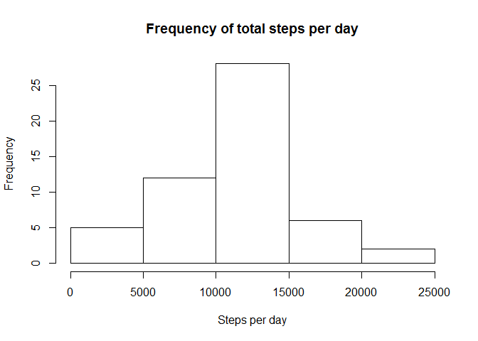
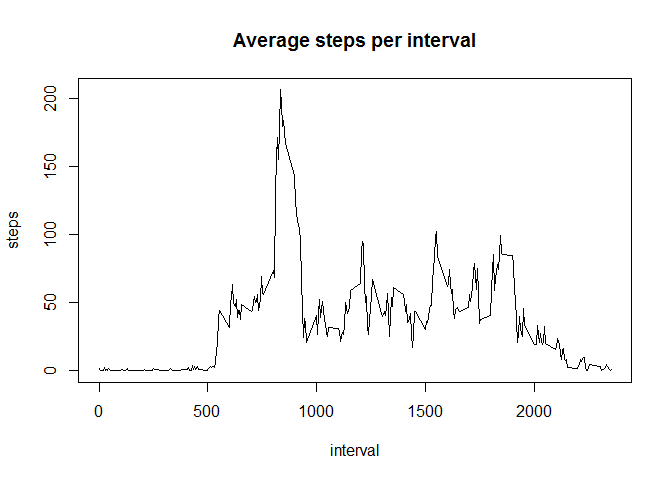
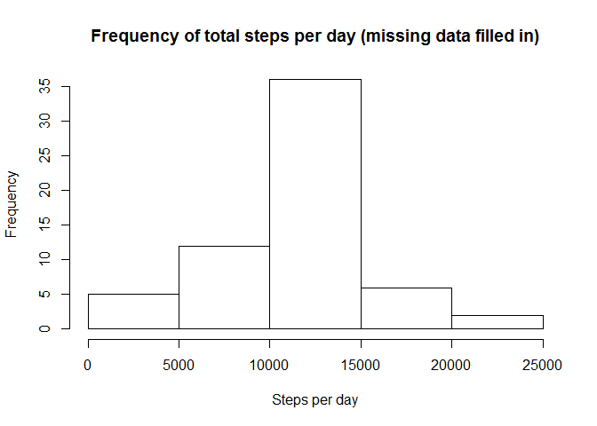
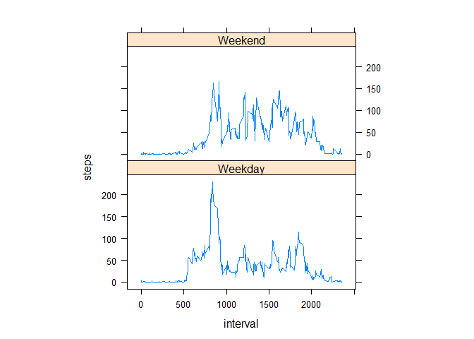

# Reproducible Research: Peer Assessment 1


## Loading and preprocessing the data


```r
data <- read.csv("activity.csv")
```


## What is mean total number of steps taken per day?


```r
total_steps_per_day <- aggregate(steps ~ date, data=data, FUN=sum, na.rm=TRUE)
hist(total_steps_per_day$steps, xlab="Steps per day", main="Frequency of total steps per day")
```

 

```r
daily_steps_mean <- mean(total_steps_per_day$steps)
daily_steps_median <- median(total_steps_per_day$steps)
```

The mean total steps per day is: **10,766**.  
The median total steps per day is: **10,765**.

## What is the average daily activity pattern?


```r
avg_steps_per_interval <- aggregate(steps ~ interval, data=data, FUN=mean, na.rm=TRUE)
plot(avg_steps_per_interval, type="l", main="Average steps per interval")
```

 

```r
highest_step_interval <- avg_steps_per_interval[which.max(avg_steps_per_interval$steps),]$interval
```

The interval with the highest average number of steps is: **835**.  


## Imputing missing values


```r
# Calculate the total number of missing values...
sum(!complete.cases(data))
```

```
## [1] 2304
```

The total number of observations missing data is: **2304**.  

The missing values will be replaced with the mean of the step count for that interval.


```r
newdata <- data
for(i in 1:nrow(newdata))
{
  if (is.na(newdata[i,"steps"]))
    newdata[i, "steps"] <- mean(subset(data, interval==data[i, "interval"])$steps, na.rm=TRUE)
}

new_total_steps_per_day <- aggregate(steps ~ date, data=newdata, FUN=sum, rm.na=TRUE)
hist(new_total_steps_per_day$steps, xlab="Steps per day", main="Frequency of total steps per day (missing data filled in)")
```

 

```r
new_daily_steps_mean <- mean(new_total_steps_per_day$steps)
new_daily_steps_median <- median(new_total_steps_per_day$steps)
```

The ***new*** mean total steps per day is: **10,767**.  
The ***new*** median total steps per day is: **10,767**.

These values are not much different than the values calculated before.  By filling in the missing data, both the mean and median were only slightly higher.

## Are there differences in activity patterns between weekdays and weekends?


```r
newdata$weekday <- weekdays(as.Date(newdata$date))

for (i in 1:nrow(newdata))
{
  if (newdata[i,"weekday"] %in% c("Saturday", "Sunday"))
  {
    newdata[i, "daytype"] <- "Weekend"
  }
  else
  {
    newdata[i, "daytype"] <- "Weekday"
  }
}

steps_per_interval_per_daytype <- aggregate(steps ~ interval + daytype, data=newdata, FUN=mean)

library(lattice)
xyplot(steps ~ interval | factor(daytype), data=steps_per_interval_per_daytype, aspect = 1/2, type="l")
```

 
